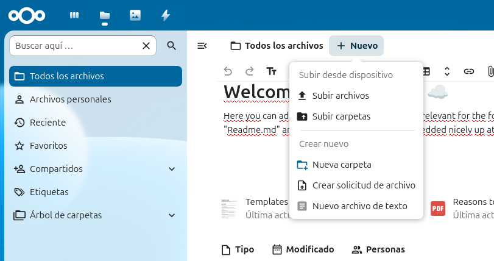
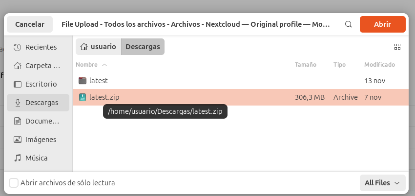
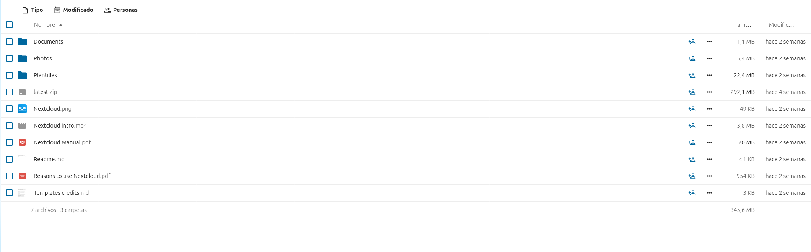
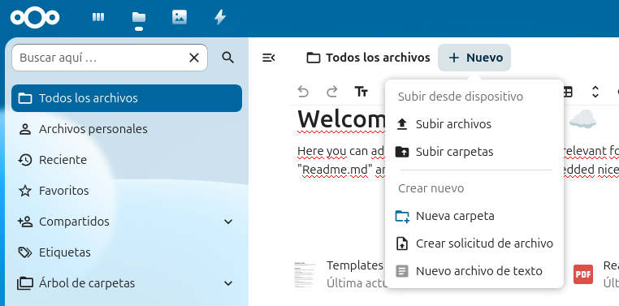
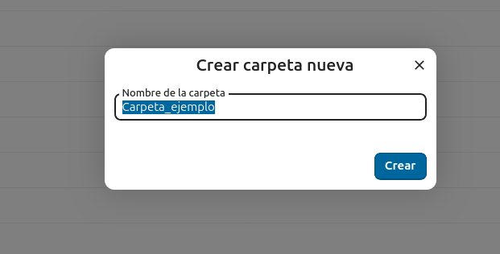
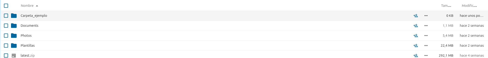
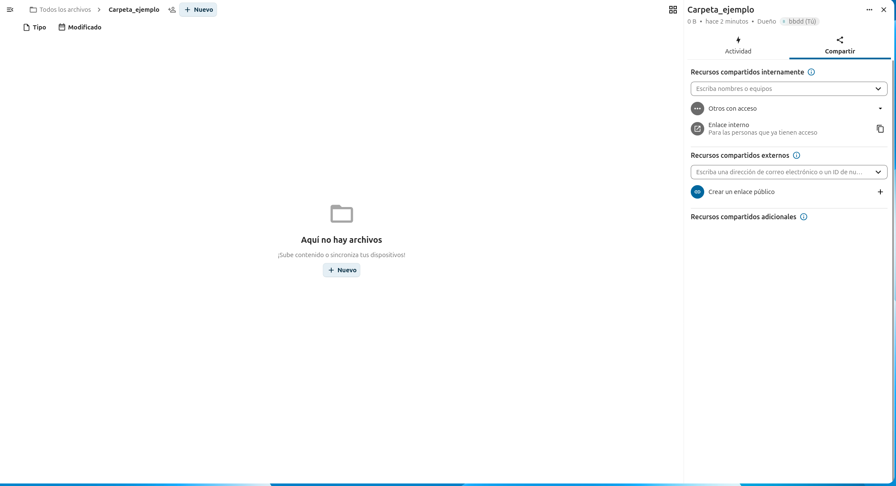

# Configuracion de NextCloud

## 1 Demostración:

## Sube un archivo/Crea una carpeta/Comparte el contenido:

### ***1.1 Para subir un archivo:***

- ### ***Tienes que ir a "Todos los archivos", darle a "+ Nuevo":***

- ### ***Seleccciona el archivo que quieres subir, haz doble click:***

- ### ***Y ya lo tendras ahí:***

### ***1.2 Para crear una carpeta nueva:***

- ### ***Dentro de "Todos los archivos" dale a "+ Nuevo" y dale a "Nueva Carpeta" :***

- ### ***Escribe el nombre que quieras ponerle, por ejemplo "Carpeta de ejemplo":***

- ### ***Y ya tendrás la carpeta creada:***

### ***1.3 Para Compartir contenido:***
- ### ***Para compartir un contenido, tienes que darle al icono donde hay una persona un simbolo de + de la carpeta o fitchero que quieres compartir:***

  
- ### ***Ahora simplemente tendras que rellenar la informacion, como poner el correo electronico i el nombre de a quien/es quieres enviarselo i compartirselo:***

## Creación de cuentas/Permisos/Efecto de los diferentes permisos

### ***2.1 Creación de cuenatas:***

- ### ***Para crear una cuenta, tienes que ir a tu perfil i darle donde pone "cuentas" ahi tendras que darle a un botton en donde pone "nueva cuenta":***

- ### ***Ahora simplemente tendras que poner la información de la cuenta como la contraseña i el nombre:***

### ***2.2 Permisos de las cuentas:***

- ### ***Para darle permisos a las cuentas, primeron tendremos que crear los grupos de cada una de las cuentas, asique iremos a cuentas i editaremas la cuenta para crear el grupo que queramos asignarle:***

- ### ***ahora tedremos que compartirle la carpeta o fichero que queramos darle acceso a la cuenta (tutoeial en el apartado 1.3), i antes de darle acceso le pondemos el permiso que queremos "Editor, visualizador o Permisos personalizados para los admins o si queremos quitarle algun permiso en especifico:***

### 2.3 Tipos de permisos i lo que pueden hacer:

***Editor***

- Puede crear, modificar y borrar archivos.
- Puede publicar o actualizar archivos existentes.
- Su trabajo se centra en el contenido, no en la administración.

***Visualizador***

- Solo puede ver y consultar el contenido.
- Es un rol solo de lectura.

***Administrador (Admin)***

- Tiene acceso total.
- Puede crear, editar y borrar cualquier archivo.
- Puede gestionar usuarios y roles.
- Puede configurar ajustes del sistema o del archivo.
- Es el rol con mayor nivel de control.

### ***2.4 Efecto de los diferentes permisos:***

- ### ***Por ejemplo, voy a poner lo que sale cuando entras en el apartado de compartir con la cuenta con permisos de Administrador i el de visualizador:***

- ### ***ADMIN:***

- ### ***VISUALIZADOR:***

## Creación de Administración de fitxeros/Politicas de seguridad

### ***3.1 Como crear una administración de archivos:***

- ### ***Para crear un sistema de archivos es muy sencillo, tendremos que hacer lo mismo que en el apartado "1.2", crearemos una carpeta, en mi caso la llamre "Documentos personales":***

- ### ***Ahora dentro de nuestra carpeta, simplemente crearemos algunas carpetas mas, en mi caso cree estas: "Fotos, Trabajos compartidos y Projecto". Y finalmente dentro de estas ya podremos meter todos nyestros archivos/fitcheros que queramos guardar i organizar:***

### ***3.2 Como poner políticas de seguridad en nuestra carpeta:***

- ### ***Para poner políticas de seguridad en una carpeta es bastante sencillo, primero nos iremos a la carpeta que queremos ponerselo, en mi ejemplo lo pondre en mi carpeta de "Documentos personales" y cuando estemos dentro iremos a la ventana de compartir:***

- ### ***Ahora, le daremos en donde pone "Create public link", seguidamente, le daremos a los tres puntitos al lado de donde pone "share link", le daremos a "Customize link" y allí añadiremos una contraseña y una fecha de caducidad, esto servira para cuando alguien comparta el link de nuestra carpeta, necesiten si o si la contraseña para entrar y por si acaso pondremos la fecha de caducidad del link tambien:***

## Configuración de acceso remoto:

- ### ***La configuración de acceso remoto a Nextcloud requiere algunos requisitos previos: tener Nextcloud instalado y funcionando dentro de una máquina virtual, asegurarse de que esa máquina esté conectada a la misma red que el dispositivo desde el cual se quiere acceder y conocer la dirección IP de la máquina virtual***

- ### ***El primer paso es comprobar la IP de la máquina virtual con un comando como ip addr show. Una vez identificada, hay que garantizar que los puertos 80 y 443, utilizados por HTTP y HTTPS, estén abiertos en el cortafuegos de la máquina para permitir la conexión.***

- ### ***Después se debe configurar el servidor web. Si se utiliza Apache, se crea un archivo de configuración que define el directorio de Nextcloud y se activa el sitio con las órdenes correspondientes. Si se utiliza Nginx, se establece un bloque de servidor con la IP y el directorio de Nextcloud, y se reinicia el servicio para aplicar los cambios.***

- ### ***Una vez configurado, el acceso desde otro dispositivo es sencillo: basta con abrir un navegador e introducir la dirección IP de la máquina virtual seguida de /nextcloud. Si se ha configurado un certificado SSL, se puede acceder de manera segura mediante HTTPS.***

- ### ***Finalmente, es importante seguir recomendaciones de seguridad: utilizar siempre HTTPS con un certificado SSL, configurar correctamente los usuarios y permisos dentro de Nextcloud, mantener el sistema y la aplicación actualizados y evitar exponer la máquina virtual directamente a Internet sin medidas adicionales como un proxy inverso.***
